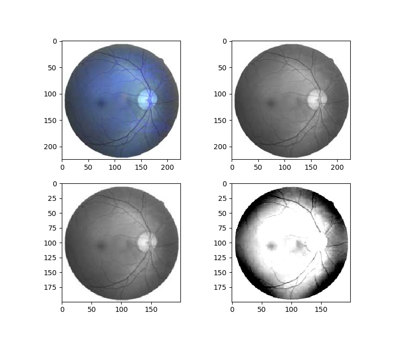

# Blindness Detection

This project is a ongoing challange on <b>Kaggle</b> where we have to develope a strategy to design a system which will be able to detet the category of blindness in the human eye.
 
According to the dataset, there are following categories such as :

    0 - NO DR
    1 - MILD
    2 - MODERATE
    3 - SEVERE
    4 - PORIFERATIVE DR

Directory Structure of the dataset ( Size 10GB ):
        
    sample_submission.csv
    test.csv
    train.csv
    train.csv
    test_images.zip
    
        0005cfc8afb6.png
        00836aaacf06.png
        009c019a7309.png
        ------
        1000+ more
        
    train_images.zip
    
        000c1434d8d7.png
        00a8624548a9.png
        00cb6555d108.png
        -----
        1000+ more

For this project i will be using the <b>Google Colab</b> because this kind of heavy image dataset requires a lot powerful device and google colab provides free storage for <b>GPU </b> or <b> TPU </b> based runtime environment and <b> python</b> will be my primary language.

The next few steps will guide the user to how to setup the environment and  how to download the dataset.

Please follow the exact steps:

    1 - To install kaggle packeges and related python packages.
            ! pip install kaggle torchvision torch pandas matplotlib numpy scipy scikit-learn
    2 - Create directory name " Kaggle"
            !mkdir ~/.kaggle
    3 - Check for existence
            !ls -a /content/.kaggle
            
To use the Kaggle API, you have to create a Kaggle account. Once you have logged in, you will have to go to the ‘My Account’ section on your profile. Then you will have to click on ‘Create New API Token’ to use the Kaggle API. The ‘Create New API Token’ button will trigger a download of a file called ‘kaggle.json’. This file has the credentials of your API token for your account.

Once you have the key, please proceed further.

    4 - Svaing the credential to the file.
            import json
            token = {"username":"YOUR_USERNAME","key":"YOUR_KEY"}
            with open('/content/kaggle.json', 'w') as file:
                json.dump(token, file)
            file.close()

    5 - Creating a copy
            !cp /content/kaggle.json  ~/.kaggle/kaggle.json

    6 - Setting up the configuration.
            !kaggle config set -n path -v{/content}
    
    7 - Giving permission.
            !chmod 600 /root/.kaggle/kaggle.json

Once you finished you can check if it is working or not by the following command.

        !kaggle datasets list
If you get output like below, Great you succeeded.

        ref                                                       title                                              size  lastUpdated          downloadCount  
        --------------------------------------------------------  ------------------------------------------------  -----  -------------
    dgomonov/new-york-city-airbnb-open-data                   New York City Airbnb Open Data                      2MB  2019-08-12 16:24:45           2443  
    lakshyaag/india-trade-data                                India - Trade Data                                  1MB  2019-08-16 16:13:58           2106  
    AnalyzeBoston/crimes-in-boston                            Crimes in Boston                                   10MB  2018-09-04 17:56:03          13908  
    jolasa/waves-measuring-buoys-data-mooloolaba              Waves Measuring Buoys Data                        599KB  2019-07-07 16:59:44           1549  
    citizen-ds-ghana/health-facilities-gh                     Ghana Health Facilities                            84KB  2018-09-03 01:19:24           1239  
    doit-intl/autotel-shared-car-locations                    Shared Cars Locations                              78MB  2019-01-10 13:06:00           1546  
    ma7555/schengen-visa-stats                                Schengen Visa Stats 2017/2018                       1MB  2019-07-25 10:55:37            301  
    dareenalharthi/jamalon-arabic-books-dataset               Jamalon Arabic Books Dataset                        1MB  2019-08-15 18:58:06             72  
    samhiatt/xenocanto-avian-vocalizations-canv-usa           Avian Vocalizations from CA & NV, USA               1GB  2019-08-10 00:16:10             44  
    Madgrades/uw-madison-courses                              UW Madison Courses and Grades 2006-2017            90MB  2018-05-15 

Now, that you are all setup, let get us into the world of Deep Learning.

The Standard procedures have been considered with slightly modification in the pre-processing phase.
The steps involved for the implementation are as discussed below:

        1 - Data Loading.
        2 - Scaling and Normalization with Ben Grahams Preprocessing technique(New).
        3 - Model Loading.
        4 - Training and saving the mode.
        
<h3>1 - Data Loading</h3>
The first step is to download the dataset and load it to the environment, The dataset can be downloaded manually or usng kaggle API.To use the kaggle API ,it reuires the installation .

To download the dataset from Kaggle please use the following command:

        !kaggle competitions download -c aptos2019-blindness-detection -p /content
        
Once the dataset is downloaded create a seperate tree like directory for training and testing which will be helpfull during further structural execution.

        1. !mkdir Train_Images Test_Images
        2. !unzip train_images.zip  -d Train_Images
        3. !unzip test_images.zip  -d Test_Images/
        4. !cd Train_Images && mkdir 0 1 2 3 4
        
Once the directory structure is ready map all the potos based on the categorical data using <b> Train.csv </b>. which looks like below:

<h4> Loading csv file </h4>

        import pandas as pd
        df = pd.read_csv("/content/train.csv",engine="python")
        print(df.head())
        
<h4> Mapping each data to their respective categorie.</h4>

        import os
        for var in df.values:
            os.system("mv /content/Train_Images/"+str(var[0])+".png"+" /content/Train_Images/"+str(var[1])+"/"+str(var[0])+".png")

<h3>2 - Scaling and Normalization with Ben Grahams Preprocessing technique(New).</h3>

Now it is the time for preprocessing part , here a new strategy has been introduced whch is called as <b>Ben Graham</b> pre processing techiniques which is named after the kaggle winner of this project last year.

It has little bit of enhancement with regular preprocessing techniques but it turns out to be the great deal.The steps will be discussed as we go.

The steps are below:

        1. Load the image.
        2. Conversion into grayscale.
        3. Resizing the image.
        4. Add Weights (New introduced).

The code description:

        1. import cv2 // Importing the library.
        2. img = cv2.imread('img/images1.jpeg') //Loading the image.
        3. img = cv2.cvtColor(img, cv2.COLOR_BGR2GRAY) // Grayscale Conversion.
        4. img = cv2.resize(img, (200,200)) // Resizing.
        5. img = cv2.addWeighted(img, 4, cv2.GaussianBlur(img, (0,0), 226//10), -4, 256) // Adding weights.

Our observation :

code for  display :

        import numpy as np
        import matplotlib.pyplot as plt
        
         w=10
         h=10
         fig=plt.figure(figsize=(8, 8))
         columns = 2
         rows = 2
         for i in range(1,5):
             img = cv2.imread(img_arr[i-1])
             fig.add_subplot(rows, columns, i)
             plt.imshow(img)
         plt.show()

<h3>3 - Model Loading.</h3>

For this type of application which requires building image processing model, there are multiple type of model present which are some how will be helpful doing this type of problem.

Few of them will be mentioned below:

        1. ImageNet
        2. Vgg19
        3. AlexNet

        .......

Each one will be benefial in different circumstances, but considering out scenario we will require such application which will be helpfull in exctraction of important features in from image and for that <b>VGG</b> model are highly recommmended.

Below are the structure of vgg19 model

                VGG(
                  (features): Sequential(
                    (0): Conv2d(3, 64, kernel_size=(3, 3), stride=(1, 1), padding=(1, 1))
                    (1): ReLU(inplace)
                    (2): Conv2d(64, 64, kernel_size=(3, 3), stride=(1, 1), padding=(1, 1))
                    (3): ReLU(inplace)
                    (4): MaxPool2d(kernel_size=2, stride=2, padding=0, dilation=1, ceil_mode=False)
                    (5): Conv2d(64, 128, kernel_size=(3, 3), stride=(1, 1), padding=(1, 1))
                    (6): ReLU(inplace)
                    (7): Conv2d(128, 128, kernel_size=(3, 3), stride=(1, 1), padding=(1, 1))
                    (8): ReLU(inplace)
                    (9): MaxPool2d(kernel_size=2, stride=2, padding=0, dilation=1, ceil_mode=False)
                    (10): Conv2d(128, 256, kernel_size=(3, 3), stride=(1, 1), padding=(1, 1))
                    (11): ReLU(inplace)
                    (12): Conv2d(256, 256, kernel_size=(3, 3), stride=(1, 1), padding=(1, 1))
                    (13): ReLU(inplace)
                    (14): Conv2d(256, 256, kernel_size=(3, 3), stride=(1, 1), padding=(1, 1))
                    (15): ReLU(inplace)
                    (16): Conv2d(256, 256, kernel_size=(3, 3), stride=(1, 1), padding=(1, 1))
                    (17): ReLU(inplace)
                    (18): MaxPool2d(kernel_size=2, stride=2, padding=0, dilation=1, ceil_mode=False)
                    (19): Conv2d(256, 512, kernel_size=(3, 3), stride=(1, 1), padding=(1, 1))
                    (20): ReLU(inplace)
                    (21): Conv2d(512, 512, kernel_size=(3, 3), stride=(1, 1), padding=(1, 1))
                    (22): ReLU(inplace)
                    (23): Conv2d(512, 512, kernel_size=(3, 3), stride=(1, 1), padding=(1, 1))
                    (24): ReLU(inplace)
                    (25): Conv2d(512, 512, kernel_size=(3, 3), stride=(1, 1), padding=(1, 1))
                    (26): ReLU(inplace)
                    (27): MaxPool2d(kernel_size=2, stride=2, padding=0, dilation=1, ceil_mode=False)
                    (28): Conv2d(512, 512, kernel_size=(3, 3), stride=(1, 1), padding=(1, 1))
                    (29): ReLU(inplace)
                    (30): Conv2d(512, 512, kernel_size=(3, 3), stride=(1, 1), padding=(1, 1))
                    (31): ReLU(inplace)
                    (32): Conv2d(512, 512, kernel_size=(3, 3), stride=(1, 1), padding=(1, 1))
                    (33): ReLU(inplace)
                    (34): Conv2d(512, 512, kernel_size=(3, 3), stride=(1, 1), padding=(1, 1))
                    (35): ReLU(inplace)
                    (36): MaxPool2d(kernel_size=2, stride=2, padding=0, dilation=1, ceil_mode=False)
                  )
                  (avgpool): AdaptiveAvgPool2d(output_size=(7, 7))
                  (classifier): Sequential(
                    (0): Linear(in_features=25088, out_features=4096, bias=True)
                    (1): ReLU(inplace)
                    (2): Dropout(p=0.5)
                    (3): Linear(in_features=4096, out_features=4096, bias=True)
                    (4): ReLU(inplace)
                    (5): Dropout(p=0.5)
                    (6): Linear(in_features=4096, out_features=1000, bias=True)
                  )
                )

I have used pre sturctured layer of VGG19 and modified the classifer layer according to my requirements.

        import torch.nn as nn
        n_inputs = vgg19.classifier[6].in_features
        # add last linear layer (n_inputs -> 5 flower classes)
        # new layers automatically have requires_grad = True
        last_layer = nn.Linear(n_inputs,5)
        vgg19.classifier[6] = last_layer

 <h5><b>This is currently ongoing project</b></h5>
